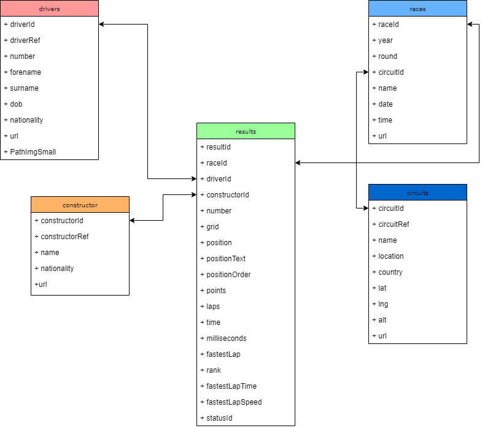

# FormulaOneStudio

### About
This is FormulaOneStudio, an Open Source Software that allows you to watch & manage a **[Formula 1](https://www.formula1.com/)** championship.
The Software is written mainly in **C# WPF Project**, with the addition of some tools written in **Python**.


> You can find some additional photos in the [gallery folder](./Assets/doc/Gallery.md).

### Documentation
- [Web API routes](./Assets/doc/WebApi.md)

### Database - FormulaOneStudioDB
For DLL : `C:\Dati`

For WebAPI: `..\FormulaOneStudioSolution\FormulaOneAPI\App_Data`
- [Create](./Assets/doc/sql/FormulaOneCreate.sql)
- [Drivers](./Assets/doc/sql/drivers.sql)
- [Constructors](./Assets/doc/sql/constructors.sql)
- [Races](./Assets/doc/sql/races.sql)
- [Circuits](./Assets/doc/sql/circuits.sql)
- [Results (2019)](./Assets/doc/sql/results.sql)

### FormulaOne DB diagram


## Building FormulaOneStudio
First, clone the repository or download the latest zip.

```
git clone https://github.com/Mihai-Canea/FormulaOneStudio.git
````
### Build using IDE
* [Visual Studio Community](https://visualstudio.microsoft.com/it/vs/community/) 2019 for ```Windows``` builds.

Open ```FormulaOneStudioSolution.sln``` in selected IDE and run ```Build``` command.
